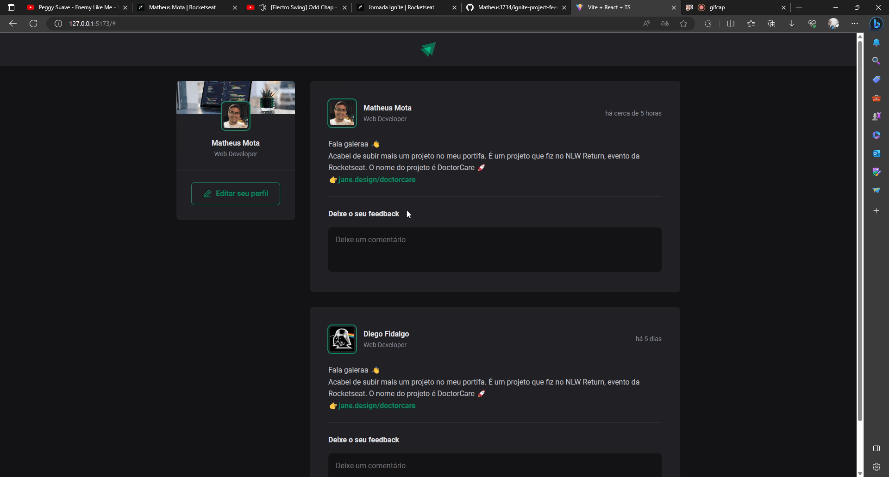
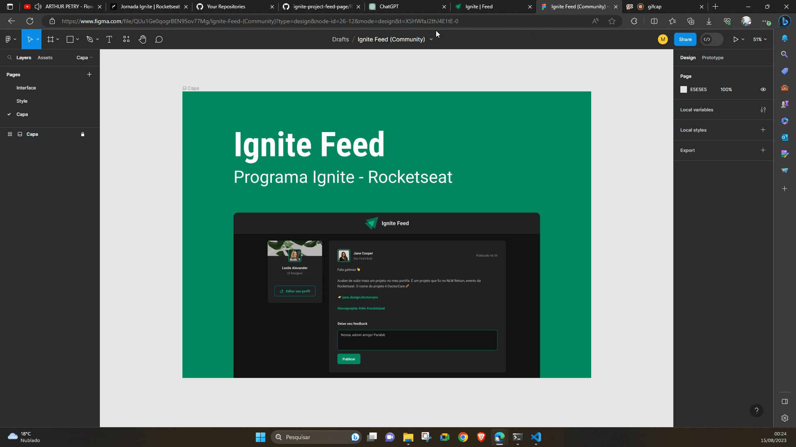

# [Ignite Feed](https://ignite-project-feed-page.vercel.app/) 🚀



This is a project created using the concepts learned in [Rocketseat's](https://www.rocketseat.com.br/) classes in the Ignite program for a comments feed.

## Design

This Front-end project was developed based on the design proposed in Figma.



## Technologies

This project was developed using Vite + ReactJS, Typescript.

The project dependencies were:

```json
"dependencies": {
    "@phosphor-icons/react": "^2.0.10",
    "date-fns": "^2.30.0",
    "react": "^18.2.0",
    "react-dom": "^18.2.0"
  },
  "devDependencies": {
    "@types/react": "^18.2.15",
    "@types/react-dom": "^18.2.7",
    "@typescript-eslint/eslint-plugin": "^6.0.0",
    "@typescript-eslint/parser": "^6.0.0",
    "@vitejs/plugin-react": "^4.0.3",
    "eslint": "^8.45.0",
    "eslint-plugin-react-hooks": "^4.6.0",
    "eslint-plugin-react-refresh": "^0.4.3",
    "typescript": "^5.0.2",
    "vite": "^4.4.5"
  }
```

## Run Project

Run the installation of dependencies with:

```shell
npm i
```

Run the exe project using the command:

```shell
npm run dev
```

😝 Enjoy!!

## What I Learned with This Project?

### Create a global file to CSS

Having a global file (`global.css`) that has standardized colors in a single file helps a lot with standardizing colors in the project and changing themes in the future.

```css
:root{
    ---white: #ffffff;
    --gray-100: #e1e1e6;
    --gray-300: #c4c4cc;
    --gray-400: #8d8d99;
    --gray-600: #323238;
    --gray-700: #29292e;
    --gray-800: #202024;
    --gray-900: #121214;

    --green-300: #00B37E;
    --green-500: #00875f;

    --red-500: #F75A68;
}
```

### Key's in React

Using Keys in react helps react in optimizing the rendering of the component on the page, so choosing a key with a unique value is essential.

```ts
...
{comments.map(comment => {
      return (
         <Comment 
            onDeleteComment={deleteComment} 
            key={comment} 
            content={comment} 
         />
      )
})}
...
```

### Imutability

In immutability, the variables do not change, a new value is created (a new space in the memory) for the variable.

Within React immutability allows for a performance boost. React looks at variables that have changed and it performs better.

A good example of this is in the comment deletion function, in which you must change and redo the list with the comment that has changed.

```ts
function deleteComment(commentToDelete: string){
   const commentsWithoutDeleteOne = comments.filter(comment => {
      return comment !== commentToDelete
   })
   setComments(commentsWithoutDeleteOne)
}
```

### Typescript

Using `Typescript` helps a lot in project development in React. Variable typing helps the developer to avoid problems during development. `Interface` development helps a lot.

```ts
export interface AuthorType{
    name: string
    role: string
    avatarUrl: string
}
```

## Acknowledgment

Thanks to Rocketseat for the content and initiatives it provides.🚀
